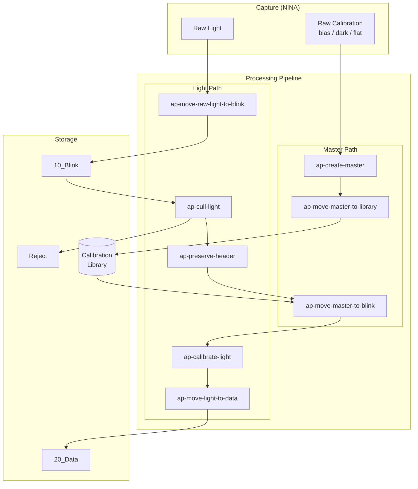
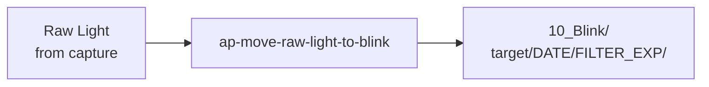
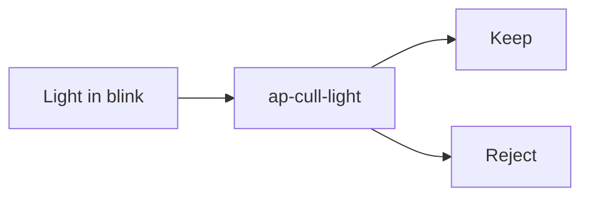
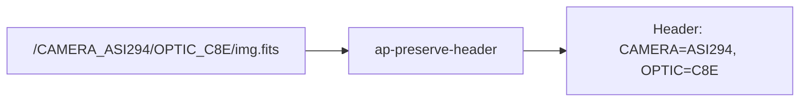
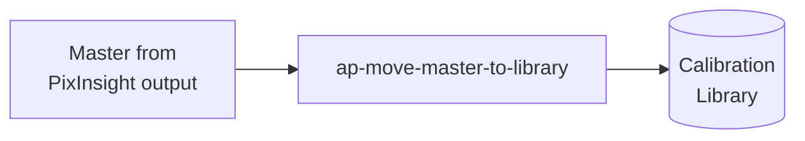
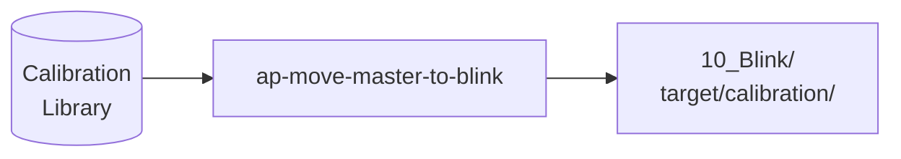
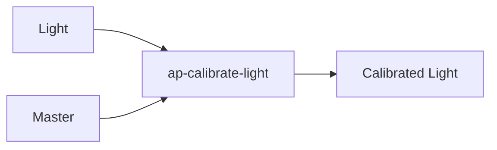
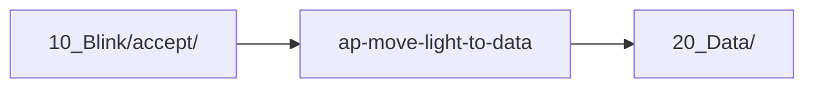
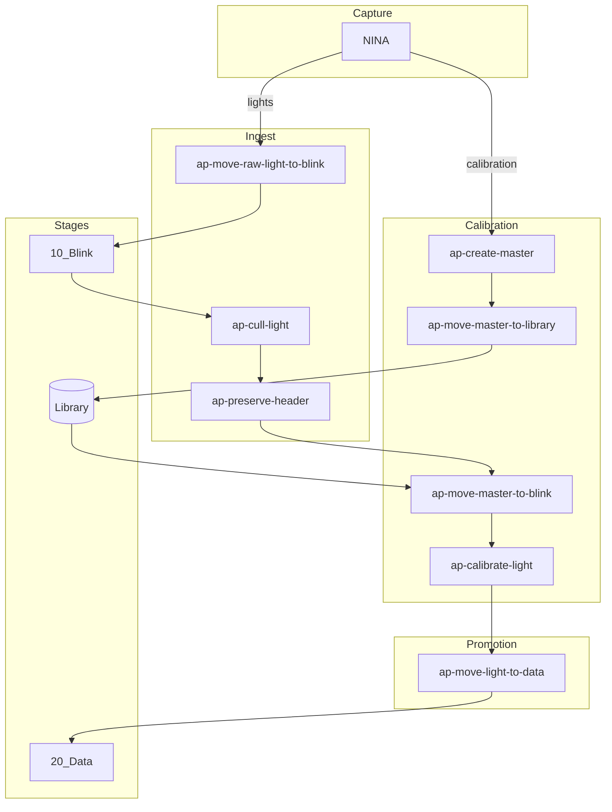

# Suggested Project Renames

## Naming Taxonomy

### Nouns (singular, consistent)

| Noun | Definition |
|------|------------|
| **light** | A light frame (science image of a target) |
| **master** | An integrated calibration frame (bias, dark, or flat) |
| **header** | Metadata stored in the file |

### Destinations

| Destination | Directory | Purpose |
|-------------|-----------|---------|
| **blink** | `10_Blink/` | Initial QC stage, visual review |
| **data** | `20_Data/` | Accepted frames, collecting more |
| **library** | `Calibration/Library/` | Organized master frame storage |

### Qualifiers

| Qualifier | Meaning |
|-----------|---------|
| **raw** | Unprocessed, directly from capture |

### Verbs

| Verb | Action |
|------|--------|
| **create** | Generate (masters from raw frames) |
| **cull** | Filter/reject based on quality metrics |
| **calibrate** | Apply calibration frames to lights |
| **preserve** | Save metadata (e.g., path → header) |
| **move** | Transfer from one location to another |
| **delete** | Remove files/frames |
| **empty** | Clean up (e.g., remove empty directories) |

## Naming Pattern

All tools follow: `ap-{verb}-{qualifier?}-{noun}-to-{destination?}`

- Every tool name starts with a **verb**
- **Qualifier** (like `raw`) is optional
- **Noun** is always singular
- **Destination** is used when the tool moves data somewhere

## Data Flow

## Proposed Renames

### Summary Table

| Current | Proposed | Pattern | Rationale |
|---------|----------|---------|-----------|
| `ap-move-lights` | `ap-move-raw-light-to-blink` | verb-qualifier-noun-to-dest | Move raw lights from capture → blink |
| `ap-cull-lights` | `ap-cull-light` | verb-noun | Cull (reject) poor quality lights |
| `ap-fits-headers` | `ap-preserve-header` | verb-noun | Preserve path metadata into header |
| `ap-master-calibration` | `ap-create-master` | verb-noun | Create masters from raw calibration |
| `ap-move-calibration` | `ap-move-master-to-library` | verb-noun-to-dest | Move masters → library |
| `ap-common` | `ap-common` | — | Shared utilities (no change) |

### New Projects

| Name | Pattern | Purpose |
|------|---------|---------|
| `ap-move-master-to-blink` | verb-noun-to-dest | Copy matching masters from library → blink for a target |
| `ap-calibrate-light` | verb-noun | Apply masters to lights |
| `ap-move-light-to-data` | verb-noun-to-dest | Move accepted lights from blink → data (future) |

## Detailed Analysis

### ap-move-raw-light-to-blink (was: ap-move-lights)

**Pattern:** `verb-qualifier-noun-to-destination`

The tool moves raw light frames from NINA capture directory into the organized `10_Blink` structure.

### ap-cull-light (was: ap-cull-lights)

**Pattern:** `verb-noun`

The tool culls (rejects) lights based on HFR and RMS thresholds.

### ap-preserve-header (was: ap-fits-headers)

**Pattern:** `verb-noun`

The tool preserves path-encoded metadata into the file header. The key insight: we're not modifying FITS specifically—we're preserving information that would otherwise be lost.

### ap-create-master (was: ap-master-calibration)

**Pattern:** `verb-noun`

The tool creates master calibration frames by integrating raw bias/dark/flat frames via PixInsight.

### ap-move-master-to-library (was: ap-move-calibration)

**Pattern:** `verb-noun-to-destination`

The tool moves master frames from PixInsight output into the organized calibration library.

### ap-move-master-to-blink (new)

**Pattern:** `verb-noun-to-destination`

Copy matching masters from the library into the blink directory for a specific target, enabling calibration.

**Matching logic:**
- Read light frame headers in target directory
- Find matching bias (camera, temp, gain, offset)
- Find matching dark (+ exposure)
- Find matching flat (+ filter, nearest date)
- Copy to target's calibration subdirectory

### ap-calibrate-light (new)

**Pattern:** `verb-noun`

Apply calibration masters to light frames (may wrap PixInsight WBPP or similar).

### ap-move-light-to-data (future)

**Pattern:** `verb-noun-to-destination`

Move accepted lights from blink to data stage.

## Complete Workflow with New Names

## Module/Package Names

Python packages use underscores:

| Project | Package |
|---------|---------|
| `ap-move-raw-light-to-blink` | `ap_move_raw_light_to_blink` |
| `ap-cull-light` | `ap_cull_light` |
| `ap-preserve-header` | `ap_preserve_header` |
| `ap-create-master` | `ap_create_master` |
| `ap-move-master-to-library` | `ap_move_master_to_library` |
| `ap-move-master-to-blink` | `ap_move_master_to_blink` |
| `ap-calibrate-light` | `ap_calibrate_light` |
| `ap-move-light-to-data` | `ap_move_light_to_data` |

## Migration Checklist

For each renamed project:

- [ ] Create new GitHub repository with new name
- [ ] Update `pyproject.toml` (name, package name)
- [ ] Rename package directory
- [ ] Update imports in code
- [ ] Update CLI entry points
- [ ] Update README and badges
- [ ] Update GitHub Actions workflows
- [ ] Archive old repository (or redirect)

For ap-base:

- [ ] Update `.gitmodules` with new URLs
- [ ] Update `patches/` directory
- [ ] Update `Makefile` targets
- [ ] Update `docs/` references
- [ ] Update `CLAUDE.md`

## Open Questions

1. Should `ap-move-master-to-blink` also set up a PixInsight project, or just copy files?
2. Is `ap-calibrate-light` a wrapper around WBPP, or a standalone calibration tool?
3. Do we need `ap-move-light-to-data`, or is that a manual step (drag/drop in file manager)?
