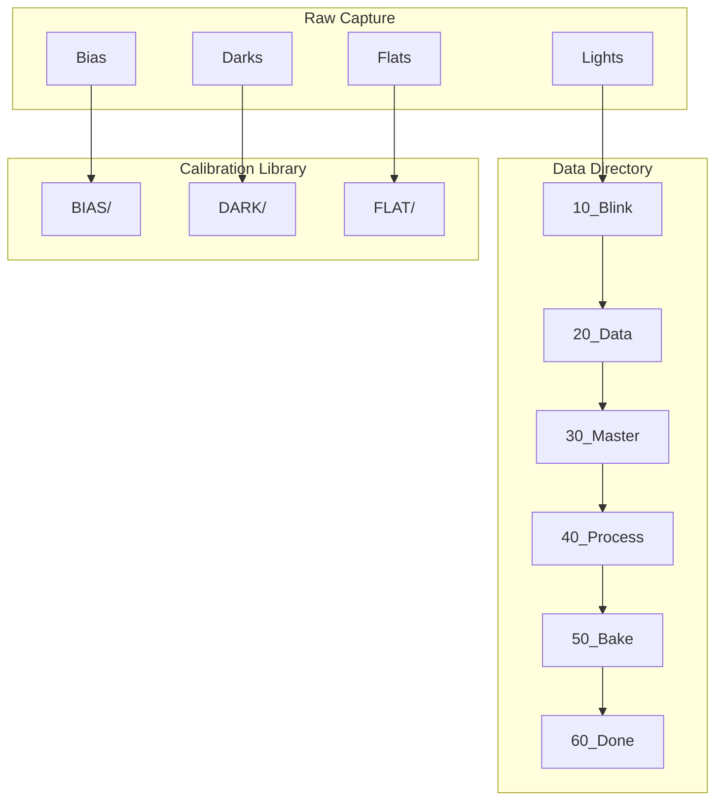
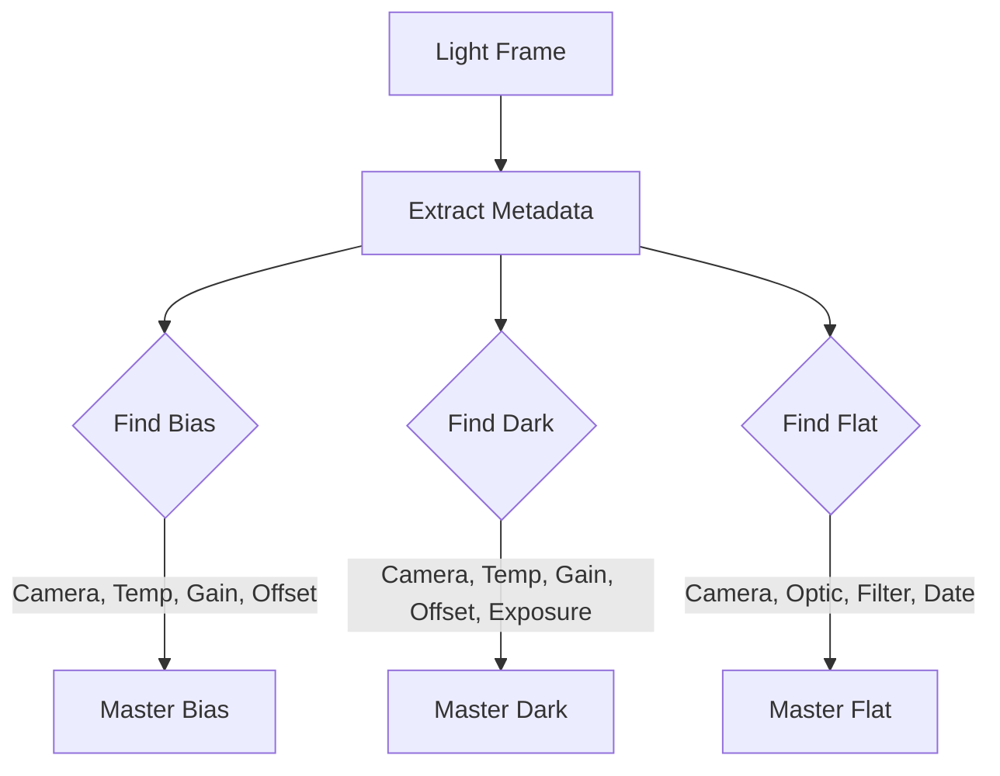

# Directory Structure

This document describes the directory structures used by the astrophotography pipeline.

## Overview



## Data Directory Structure

The data directory organizes light frames through a multi-stage workflow:

```
{data_root}/
└── {optic}@f{focal_ratio}+{camera}/    # Optical configuration
    ├── 10_Blink/                        # Initial QC stage
    │   └── {target}/
    │       └── DATE_{YYYY-MM-DD}/
    │           └── FILTER_{filter}_EXP_{exposure}/
    │               ├── image_001.fits
    │               ├── image_002.fits
    │               └── accept/          # Reviewed frames
    │                   └── ...
    ├── 20_Data/                         # Collecting more data
    │   └── {target}/...
    ├── 30_Master/                       # Creating masters
    │   └── {target}/...
    ├── 40_Process/                      # Active processing
    │   └── {target}/...
    ├── 50_Bake/                         # Review before publish
    │   └── {target}/...
    └── 60_Done/                         # Published, archived
        └── {target}/...
```

### Path Components

| Component | Example | Description |
|-----------|---------|-------------|
| `{optic}` | `C8E`, `SQA55` | Telescope/lens name |
| `{focal_ratio}` | `10`, `5.6` | Focal ratio |
| `{camera}` | `ASI294MC`, `DWARFIII` | Camera model |
| `{target}` | `M42`, `NGC7000` | Target name |
| `{YYYY-MM-DD}` | `2026-01-29` | Observation date |
| `{filter}` | `L`, `Ha`, `OIII` | Filter name |
| `{exposure}` | `300`, `120` | Exposure time in seconds |

### Mosaic Panels

For mosaic projects, a PANEL identifier is appended:

```
FILTER_{filter}_EXP_{exposure}_PANEL_{N}/
```

Example: `FILTER_L_EXP_300_PANEL_1/`

## Calibration Library Structure

The calibration library organizes master frames for efficient lookup:

```
{calibration_library}/
├── BIAS/
│   └── {camera}/
│       └── masterBias_GAIN_{gain}_OFFSET_{offset}_TEMP_{temp}.xisf
│
├── DARK/
│   └── {camera}/
│       └── masterDark_EXPTIME_{exposure}_GAIN_{gain}_OFFSET_{offset}_TEMP_{temp}.xisf
│
└── FLAT/
    └── {camera}/
        └── {optic}/                     # Optional - only if optic in header
            └── DATE_{YYYY-MM-DD}/
                └── masterFlat_FILTER_{filter}_GAIN_{gain}_OFFSET_{offset}.xisf
```

### Calibration Matching

When matching calibration frames to lights:



**Matching Priority**:

| Frame Type | Match Criteria | Notes |
|------------|----------------|-------|
| Bias | Camera, Temp, Gain, Offset, Readout | Exact match required |
| Dark | Above + Exposure | Lower or equal exposure preferred |
| Flat | Above + Filter + Date | Nearest date if exact not available |

## Raw Capture Structure

NINA typically captures to a structure like:

```
{capture_root}/
└── {date}/
    └── {sequence_name}/
        └── LIGHT/
            └── {target}/
                └── {filter}/
                    └── {target}_{filter}_{exposure}s_{index}.fits
```

The `ap-move-lights` tool reorganizes this into the data directory structure.

## Reject Directory Structure

Rejected frames maintain their relative structure:

```
{reject_root}/
└── {relative_path_from_source}/
    └── rejected_image.fits
```

This preserves context about where the rejected frame originated.

## Environment Variables

Several paths can be configured via environment variables:

| Variable | Purpose | Example |
|----------|---------|---------|
| `AP_DATA_ROOT` | Root data directory | `D:\Astrophotography\Data` |
| `AP_CALIBRATION_LIBRARY` | Calibration library | `D:\Calibration\Library` |
| `AP_REJECT_DIR` | Reject directory | `D:\Astrophotography\Reject` |

Tools use `ap-common.utils.replace_env_vars()` to expand these in configuration.

## Example Full Structure

```
D:\Astrophotography\
├── Data\
│   ├── C8E@f10+ASI294MC\
│   │   ├── 10_Blink\
│   │   │   └── M42\
│   │   │       └── DATE_2026-01-15\
│   │   │           ├── FILTER_L_EXP_300\
│   │   │           │   ├── M42_L_300s_001.fits
│   │   │           │   └── accept\
│   │   │           └── FILTER_Ha_EXP_600\
│   │   │               └── ...
│   │   ├── 20_Data\
│   │   │   └── NGC7000\
│   │   │       └── ...
│   │   └── 60_Done\
│   │       └── M31\
│   │           └── ...
│   └── SQA55@f5.6+DWARFIII\
│       └── ...
│
├── Calibration\
│   ├── Library\
│   │   ├── BIAS\
│   │   │   └── ASI294MC\
│   │   │       └── masterBias_GAIN_100_OFFSET_10_TEMP_-10.xisf
│   │   ├── DARK\
│   │   │   └── ASI294MC\
│   │   │       ├── masterDark_EXPTIME_120_GAIN_100_OFFSET_10_TEMP_-10.xisf
│   │   │       └── masterDark_EXPTIME_300_GAIN_100_OFFSET_10_TEMP_-10.xisf
│   │   └── FLAT\
│   │       └── ASI294MC\
│   │           └── C8E\
│   │               ├── DATE_2026-01-10\
│   │               │   └── masterFlat_FILTER_L_GAIN_100_OFFSET_10.xisf
│   │               └── DATE_2026-01-15\
│   │                   └── masterFlat_FILTER_Ha_GAIN_100_OFFSET_10.xisf
│   └── Raw\
│       └── ...
│
└── Reject\
    └── C8E@f10+ASI294MC\
        └── 10_Blink\
            └── M42\
                └── DATE_2026-01-15\
                    └── FILTER_L_EXP_300\
                        └── M42_L_300s_047.fits  # Rejected due to high RMS
```
