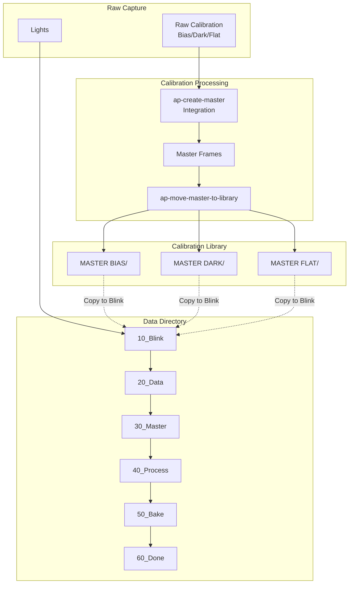
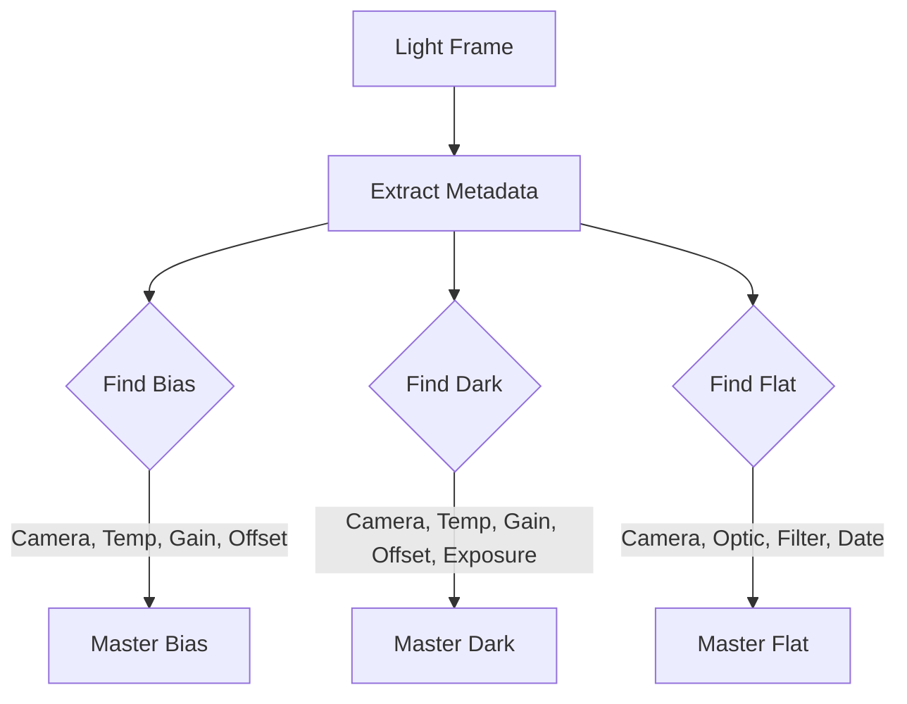

# Directory Structure

This document describes the directory structures used by the astrophotography pipeline.

## Overview



## Data Directory Structure

The data directory organizes light frames through a multi-stage workflow:

```
{data_root}/
└── {optic}@f{focal_ratio}+{camera}/    # Optical configuration
    ├── 10_Blink/                        # Initial QC stage
    │   └── {target}/
    │       └── accept/                  # Reviewed frames
    │           └── DATE_{YYYY-MM-DD}/
    │               └── FILTER_{filter}_EXP_{exposure}/
    │                   ├── image_001.fits
    │                   ├── image_002.fits
    │                   └── ...
    ├── 20_Data/                         # Collecting more data
    │   └── {target}/
    │       └── accept/
    │           └── DATE_{YYYY-MM-DD}/
    │               └── FILTER_{filter}_EXP_{exposure}/...
    ├── 30_Master/                       # Creating masters
    │   └── {target}/
    │       ├── accept/
    │       │   └── DATE_{YYYY-MM-DD}/
    │       │       └── FILTER_{filter}_EXP_{exposure}/...
    │       └── master/
    │           └── DATE_{YYYY-MM-DD}/
    │               └── FILTER_{filter}_EXP_{exposure}/...
    ├── 40_Process/                      # Active processing
    │   └── {target}/...
    ├── 50_Bake/                         # Review before publish
    │   └── {target}/...
    └── 60_Done/                         # Published, archived
        └── {target}/...
```

### Path Components

| Component | Example | Description |
|-----------|---------|-------------|
| `{optic}` | `C8E`, `SQA55` | Telescope/lens name |
| `{focal_ratio}` | `10`, `5.6` | Focal ratio |
| `{camera}` | `ASI294MC`, `DWARFIII` | Camera model |
| `{target}` | `M42`, `NGC7000` | Target name |
| `{YYYY-MM-DD}` | `2026-01-29` | Observation date |
| `{filter}` | `L`, `Ha`, `OIII` | Filter name |
| `{exposure}` | `300`, `120` | Exposure time in seconds |

### Mosaic Panels

For mosaic projects, a PANEL identifier is appended:

```
FILTER_{filter}_EXP_{exposure}_PANEL_{N}/
```

Example: `FILTER_L_EXP_300_PANEL_1/`

## Calibration Library Structure

The calibration library organizes master frames for efficient lookup and uniqueness, presenting critical headers in the path and filename.

**Note:** FITS header keywords containing dashes (e.g., `SET-TEMP`, `DATE-OBS`) are written without dashes in filenames for filesystem compatibility (e.g., `SETTEMP`, `DATE_YYYY-MM-DD`).

```
{calibration_library}/
├── MASTER BIAS/
│   └── {camera}/
│       └── masterBias_GAIN_{gain}_OFFSET_{offset}_SETTEMP_{settemp}_READOUTM_{readoutmode}.xisf
│
├── MASTER DARK/
│   └── {camera}/
│       └── masterDark_EXPOSURE_{exposure}_GAIN_{gain}_OFFSET_{offset}_SETTEMP_{settemp}_READOUTM_{readoutmode}.xisf
│
└── MASTER FLAT/
    └── {camera}/
        └── {optic}/                     # Optional - only if optic in header
            └── DATE_{YYYY-MM-DD}/
                └── masterFlat_FILTER_{filter}_GAIN_{gain}_OFFSET_{offset}_SETTEMP_{settemp}_FOCALLEN_{focallength}_READOUTM_{readoutmode}.xisf
```

### Calibration Matching

When matching calibration frames to lights:



**Matching Priority**:

| Frame Type | Match Criteria | Notes |
|------------|----------------|-------|
| Bias | Camera, Temp, Gain, Offset \*, Readout \* | Exact match required |
| Dark | Above + Exposure | Lower or equal exposure preferred |
| Flat | Above + Filter + Date | Nearest date if exact not available |
\* if available, else ignored

## Raw Capture Structure

NINA captures to a structure defined by the user, set under Options --> Imaging in the "Image File Pattern" parameter.  Note that the `HFR` and `RMS` parameters are NOT captured as fits headers.  This is the value used by the author as of Jan 29, 2026:

```
$$IMAGETYPE$$\$$TELESCOPE$$+$$CAMERA$$\$$TARGETNAME$$\DATE_$$DATEMINUS12$$\FILTER_$$FILTER$$_EXP_$$EXPOSURETIME$$_SETTEMP_$$TEMPERATURESETPOINT$$\$$DATETIME$$_HFR_$$HFR$$_RMSAC_$$RMSARCSEC$$_TEMP_$$SENSORTEMP$$
```

NOTE: `RMSAC` is used but the "C" is probably a typo.. but it has persevered through scripts so just go with it..

The `ap-move-raw-light-to-blink` tool reorganizes this into the data directory structure.  And `ap-cull-light` rejects outliers based on HFR and RMS values.

## Reject Directory Structure

Rejected frames maintain their relative structure.  If run _after_ `ap-move-raw-light-to-blink` you will see the exact original structure, making it very easy to identify what is what.

HINT: if in a bind, you can always run `ap-move-raw-light-to-blink` against the rejected files or any other directory with raw lights and it will reorganize it for you again!

## Environment Variables

The tool will expand environment variables, so you can define global env vars for your convenience.

## Example Full Structure

```
D:\Astrophotography\
├── Data\
│   ├── C8E@f10+ASI294MC\
│   │   ├── 10_Blink\
│   │   │   └── M42\
│   │   │       └── DATE_2026-01-15\
│   │   │           ├── FILTER_L_EXP_300\
│   │   │           │   ├── M42_L_300s_001_HFR_1.8_RMSAC_0.8.fits
│   │   │           │   └── accept\
│   │   │           └── FILTER_Ha_EXP_600\
│   │   │               └── ...
│   │   ├── 20_Data\
│   │   │   └── NGC7000\
│   │   │       └── ...
│   │   └── 60_Done\
│   │       └── M31\
│   │           └── ...
│   └── SQA55@f5.6+ATR585M\
│       └── ...
│
├── Calibration\
│   ├── Library\
│   │   ├── MASTER BIAS\
│   │   │   └── ASI294MC\
│   │   │       └── masterBias_GAIN_100_OFFSET_10_SETTEMP_-10_READOUTM_HighSpeed.xisf
│   │   ├── MASTER DARK\
│   │   │   └── ASI294MC\
│   │   │       ├── masterDark_EXPOSURE_120_GAIN_100_OFFSET_10_SETTEMP_-10_READOUTM_HighSpeed.xisf
│   │   │       └── masterDark_EXPOSURE_300_GAIN_100_OFFSET_10_SETTEMP_-10_READOUTM_HighSpeed.xisf
│   │   └── MASTER FLAT\
│   │       └── ASI294MC\
│   │           └── C8E\
│   │               ├── DATE_2026-01-10\
│   │               │   └── masterFlat_FILTER_L_GAIN_100_OFFSET_10_SETTEMP_-10_FOCALLEN_2032_READOUTM_HighSpeed.xisf
│   │               └── DATE_2026-01-15\
│   │                   └── masterFlat_FILTER_Ha_GAIN_100_OFFSET_10_SETTEMP_-10_FOCALLEN_2032_READOUTM_HighSpeed.xisf
│   └── Raw\
│       └── ...
│
└── Reject\
    └── C8E@f10+ASI294MC\
        └── 10_Blink\
            └── M42\
                └── DATE_2026-01-15\
                    └── FILTER_L_EXP_300\
                        └── M42_L_300s_047_HFR_5.7_RMSAC_3.2.fits
```
