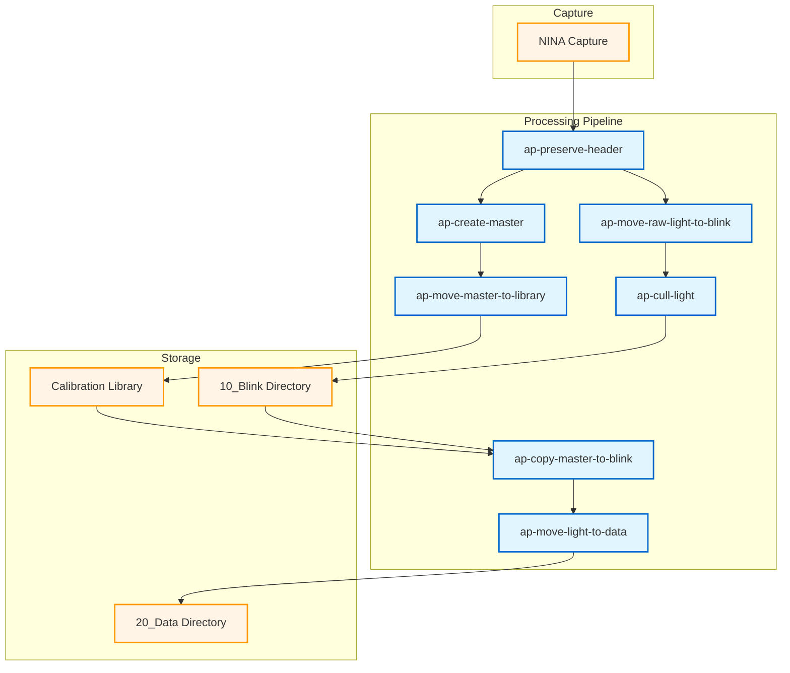

# Astrophotography Pipeline Documentation

A modular Python toolkit for processing and managing astrophotography data captured with NINA (Nighttime Imaging 'N' Astronomy).

## Overview

This pipeline provides a comprehensive workflow for processing astrophotography data from raw capture through organization, quality control, calibration frame management, and archiving. The tools are designed to work together while remaining independently useful.



## Tools

| Tool | Purpose |
|------|---------|
| [ap-common](tools/ap-common.md) | Shared utilities for data handling |
| [ap-move-raw-light-to-blink](tools/ap-move-raw-light-to-blink.md) | Organize light frames by metadata |
| [ap-cull-light](tools/ap-cull-light.md) | Quality control filtering |
| [ap-empty-directory](tools/ap-empty-directory.md) | Directory cleanup utility |
| [ap-preserve-header](tools/ap-preserve-header.md) | Preserve path metadata in FITS headers |
| [ap-create-master](tools/ap-create-master.md) | Generate master calibration frames |
| [ap-move-master-to-library](tools/ap-move-master-to-library.md) | Organize calibration library |
| [ap-copy-master-to-blink](tools/ap-copy-master-to-blink.md) | Copy masters from library to blink |
| [ap-move-light-to-data](tools/ap-move-light-to-data.md) | Move lights when calibration available |

## Quick Start

### Installation

All tools can be installed from git:

```bash
python -m pip install git+https://github.com/jewzaam/ap-move-raw-light-to-blink.git
python -m pip install git+https://github.com/jewzaam/ap-cull-light.git
python -m pip install git+https://github.com/jewzaam/ap-empty-directory.git
python -m pip install git+https://github.com/jewzaam/ap-move-light-to-data.git
python -m pip install git+https://github.com/jewzaam/ap-preserve-header.git
python -m pip install git+https://github.com/jewzaam/ap-create-master.git
python -m pip install git+https://github.com/jewzaam/ap-move-master-to-library.git
python -m pip install git+https://github.com/jewzaam/ap-copy-master-to-blink.git
```

The `ap-common` package is installed automatically as a dependency.

### Basic Workflow

```bash
# 1. Move light frames from raw capture to organized structure
python -m ap_move_raw_light_to_blink /raw/capture /data

# 2. Cull poor quality frames
python -m ap_cull_light /data/10_Blink /reject --max-hfr 2.5 --max-rms 2.0

# 3. Preserve path metadata in FITS headers
python -m ap_preserve_header /data --include CAMERA OPTIC FILTER

# 4. Generate master calibration frames
python -m ap_create_master /raw/calibration /output --pixinsight-binary "/path/to/PixInsight"

# 5. Organize calibration library
python -m ap_move_master_to_library /output/master /calibration_library

# 6. Clean calibration output directory
ap-empty-directory /output --recursive

# 7. Copy masters from library to blink directories
python -m ap_copy_master_to_blink /calibration_library /data/equipment/10_Blink

# 8. Move lights to data when calibration available
python -m ap_move_light_to_data /data/equipment/10_Blink /data/equipment/20_Data
```

## Documentation

- [Quick Start](quick-start.md) - Set up batch scripts for the processing workflow
- [Workflow Guide](workflow.md) - Detailed workflow documentation
- [Directory Structure](directory-structure.md) - How files are organized
- [Tool Reference](tools/) - Individual tool documentation

## Requirements

- Python 3.10+
- PixInsight (for master calibration generation)
- NINA (for image capture - not part of this toolkit)

## License

Apache-2.0
