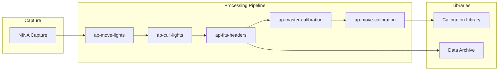

# Astrophotography Pipeline Documentation

A modular Python toolkit for processing and managing astrophotography data captured with NINA (Nighttime Imaging 'N' Astronomy).

## Overview

This pipeline provides a comprehensive workflow for processing astrophotography data from raw capture through organization, quality control, calibration frame management, and archiving. The tools are designed to work together while remaining independently useful.



## Tools

| Tool | Purpose |
|------|---------|
| [ap-common](tools/ap-common.md) | Shared utilities for FITS/XISF handling |
| [ap-move-lights](tools/ap-move-lights.md) | Organize light frames by metadata |
| [ap-cull-lights](tools/ap-cull-lights.md) | Quality control filtering |
| [ap-fits-headers](tools/ap-fits-headers.md) | Preserve path metadata in FITS headers |
| [ap-master-calibration](tools/ap-master-calibration.md) | Generate master calibration frames |
| [ap-move-calibration](tools/ap-move-calibration.md) | Organize calibration library |

## Quick Start

### Installation

All tools can be installed from git:

```bash
pip install git+https://github.com/jewzaam/ap-move-lights.git
pip install git+https://github.com/jewzaam/ap-cull-lights.git
pip install git+https://github.com/jewzaam/ap-fits-headers.git
pip install git+https://github.com/jewzaam/ap-master-calibration.git
pip install git+https://github.com/jewzaam/ap-move-calibration.git
```

The `ap-common` package is installed automatically as a dependency.

### Basic Workflow

```bash
# 1. Move light frames from raw capture to organized structure
python -m ap_move_lights /raw/capture /data --dryrun

# 2. Cull poor quality frames
python -m ap_cull_lights /data/10_Blink /reject --max-hfr 2.5 --max-rms 2.0

# 3. Preserve path metadata in FITS headers
python -m ap_fits_headers /data --include CAMERA OPTIC FILTER

# 4. Generate master calibration frames
python -m ap_master_calibration /calibration /output --pixinsight-binary "/path/to/PixInsight"

# 5. Organize calibration library
python -m ap_move_calibration /output/master /calibration_library
```

## Documentation

- [Workflow Guide](workflow.md) - Detailed workflow documentation
- [Directory Structure](directory-structure.md) - How files are organized
- [Tool Reference](tools/) - Individual tool documentation

## Requirements

- Python 3.10+
- PixInsight (for master calibration generation)
- NINA (for image capture - not part of this toolkit)

## License

Apache-2.0
