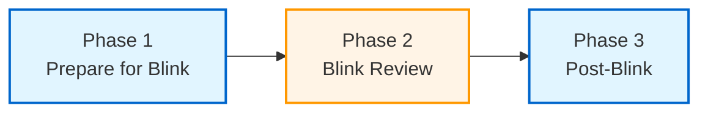

# Quick Start: Batch Processing Workflow

This guide walks through setting up Windows batch scripts to automate the
astrophotography processing pipeline. The workflow is split into three phases
with a manual blink review between the automated steps.

## Prerequisites

- Python 3.10+
- [PixInsight](https://pixinsight.com/) installed
- All pipeline tools installed (see [Installation](index.md#installation))
- NINA-captured data in the expected [raw capture structure](directory-structure.md#raw-capture-structure)

## Workflow Phases



| Phase | Type | Steps |
|-------|------|-------|
| **1. Prepare for Blink** | Automated | Preserve headers, move lights, cull poor frames |
| **2. Blink Review** | Manual | Visual inspection in blink tool |
| **3. Post-Blink** | Automated | Create masters, organize library, copy calibration, move to data |

## Script Layout

```text
workflow/
├── config.bat                  # Shared paths and settings
├── rigs/                       # One .bat per active rig
│   ├── c8e-asi2600mm.bat
│   └── sqa55-atr585m.bat
├── 01-prepare-for-blink.bat
└── 02-post-blink.bat
```

Rig-specific settings (directory names, culling thresholds) are isolated in
per-rig config files under `rigs/`. Only rigs you are actively processing need
a config file in that directory. This keeps the phase scripts generic regardless
of how many rigs you own.

## Configuration

### Shared Configuration (`config.bat`)

Define paths that apply to all rigs. Update these to match your system.

```bat
@echo off

@REM === Shared Paths ===
@REM Root of NINA raw capture output
set RAW_ROOT=D:\Astrophotography\RAW

@REM Subdirectories under RAW_ROOT
set RAW_LIGHT=%RAW_ROOT%\LIGHT
set RAW_BIAS=%RAW_ROOT%\BIAS
set RAW_DARK=%RAW_ROOT%\DARK
set RAW_FLAT=%RAW_ROOT%\FLAT

@REM Data directory (contains rig profile subdirectories)
set DATA_ROOT=D:\Astrophotography\Data

@REM Where rejected frames are moved
set REJECT_DIR=D:\Astrophotography\Reject

@REM Calibration library (permanent master storage)
set CAL_LIBRARY=D:\Astrophotography\_Library

@REM Calibration working directory (temporary integration output)
set CAL_OUTPUT=D:\Astrophotography\_calibration

@REM PixInsight binary path
set PIXINSIGHT=C:\Program Files\PixInsight\bin\PixInsight.exe
```

### Rig Configuration (`rigs/*.bat`)

Each rig file defines the rig's directory name and quality thresholds. The
directory name must match the profile directory under `DATA_ROOT` exactly.

**Example: `rigs/c8e-asi2600mm.bat`** (longer focal length, more tolerant HFR)

```bat
@REM Rig profile directory name (must match directory under DATA_ROOT)
set RIG_DIR=C8E@f10.0+ZWO ASI2600MM Pro

@REM RMS culling: reject frames with guiding error above this threshold
set CULL_RMS_MAX=2.0
set CULL_RMS_AUTO_ACCEPT=100

@REM HFR culling: reject frames with poor star focus above this threshold
set CULL_HFR_MAX=7.0
set CULL_HFR_AUTO_ACCEPT=30
```

**Example: `rigs/sqa55-atr585m.bat`** (shorter focal length, tighter HFR)

```bat
set RIG_DIR=SQA55@f5.3+ATR585M

set CULL_RMS_MAX=2.0
set CULL_RMS_AUTO_ACCEPT=100

set CULL_HFR_MAX=4.0
set CULL_HFR_AUTO_ACCEPT=10
```

### Choosing Thresholds

Culling thresholds are rig-dependent. Longer focal lengths typically need
higher HFR tolerances due to image scale differences.

| Parameter | Purpose | Guidance |
|-----------|---------|----------|
| `CULL_RMS_MAX` | Max guiding error (arcsec) | Start at 2.0, tighten if guiding is solid |
| `CULL_RMS_AUTO_ACCEPT` | Auto-accept if rejection % is below this | 100 = always auto-accept RMS rejections |
| `CULL_HFR_MAX` | Max star size (pixels) | Scale with focal length; shorter FL = tighter |
| `CULL_HFR_AUTO_ACCEPT` | Auto-accept if rejection % is below this | Lower = more conservative, prompts for review |

## Phase 1: Prepare for Blink

This phase preserves metadata, organizes lights, and culls poor frames. After
this phase completes, frames are ready for manual blink review.

**`01-prepare-for-blink.bat`**

```bat
@echo off
setlocal enabledelayedexpansion
call config.bat

echo === Phase 1: Prepare for Blink ===

@REM --- Preserve headers ---
@REM Light frames: preserve rig metadata from NINA paths
echo Preserving light frame headers...
python -m ap_preserve_header "%RAW_LIGHT%" --include INSTRUME OFFSET READOUTM

@REM Calibration frames: preserve equipment metadata from NINA paths
echo Preserving calibration frame headers...
python -m ap_preserve_header "%RAW_BIAS%" --include CAMERA OPTIC FILTER
python -m ap_preserve_header "%RAW_DARK%" --include CAMERA OPTIC FILTER
python -m ap_preserve_header "%RAW_FLAT%" --include CAMERA OPTIC FILTER

@REM --- Move lights to blink structure ---
echo Moving light frames to blink directories...
python -m ap_move_raw_light_to_blink "%RAW_LIGHT%" "%DATA_ROOT%"

@REM --- Cull poor quality frames (per-rig thresholds) ---
echo Culling poor quality frames...
for %%r in (rigs\*.bat) do (
    call %%r
    echo Culling for !RIG_DIR!...
    python -m ap_cull_light "%DATA_ROOT%\!RIG_DIR!\10_Blink" "%REJECT_DIR%" --max-rms !CULL_RMS_MAX! --auto-accept-percent !CULL_RMS_AUTO_ACCEPT!
    python -m ap_cull_light "%DATA_ROOT%\!RIG_DIR!\10_Blink" "%REJECT_DIR%" --max-hfr !CULL_HFR_MAX! --auto-accept-percent !CULL_HFR_AUTO_ACCEPT!
)

echo.
echo === Phase 1 Complete ===
echo Review frames in your blink tool, then run 02-post-blink.bat
pause
```

### What Happens

1. **Preserve headers** writes path-encoded metadata (instrument, offset,
   readout mode for lights; camera, optic, filter for calibration frames) into
   FITS headers. This must happen before files are moved, since the organized
   directory structure may not preserve all path information.
   See [ap-preserve-header](tools/ap-preserve-header.md).

2. **Move lights** reorganizes raw light frames into the
   `{rig}/10_Blink/{target}/DATE_{date}/FILTER_{filter}_EXP_{exp}/` structure.
   See [ap-move-raw-light-to-blink](tools/ap-move-raw-light-to-blink.md).

3. **Cull frames** rejects outliers based on HFR and RMS thresholds defined
   in each rig's config. RMS culling runs first (guiding errors), then HFR
   (focus quality). See [ap-cull-light](tools/ap-cull-light.md).

## Phase 2: Blink Review

Open your blink/review tool and manually inspect the remaining frames. Accept
good frames and reject any the automated culling missed. This is the only
manual step in the workflow.

## Phase 3: Post-Blink

This phase creates master calibration frames, organizes them into the library,
copies calibration to blink directories, and moves lights to data.

**`02-post-blink.bat`**

```bat
@echo off
setlocal enabledelayedexpansion
call config.bat

echo === Phase 3: Post-Blink ===

@REM --- Create master calibration frames ---
@REM Order matters: bias and darks first, then flats (which need bias/dark masters)
echo Creating master bias...
python -m ap_create_master "%RAW_BIAS%" "%CAL_OUTPUT%\bias" --pixinsight-binary "%PIXINSIGHT%"

echo Creating master dark...
python -m ap_create_master "%RAW_DARK%" "%CAL_OUTPUT%\dark" --pixinsight-binary "%PIXINSIGHT%"

@REM Move bias and darks to library before creating flats
echo Moving master bias to library...
python -m ap_move_master_to_library "%CAL_OUTPUT%\bias\master" "%CAL_LIBRARY%"

echo Moving master dark to library...
python -m ap_move_master_to_library "%CAL_OUTPUT%\dark\master" "%CAL_LIBRARY%"

@REM Create flats using bias/dark masters from library
echo Creating master flat...
python -m ap_create_master "%RAW_FLAT%" "%CAL_OUTPUT%\flat" --pixinsight-binary "%PIXINSIGHT%" --bias-master-dir "%CAL_LIBRARY%\MASTER BIAS" --dark-master-dir "%CAL_LIBRARY%\MASTER DARK"

echo Moving master flat to library...
python -m ap_move_master_to_library "%CAL_OUTPUT%\flat\master" "%CAL_LIBRARY%"

@REM --- Copy calibration to blink and move lights to data (per-rig) ---
for %%r in (rigs\*.bat) do (
    call %%r
    echo Copying masters to blink for !RIG_DIR!...
    python -m ap_copy_master_to_blink "%CAL_LIBRARY%" "%DATA_ROOT%\!RIG_DIR!\10_Blink" --flat-state "%DATA_ROOT%\!RIG_DIR!\flat-state.yaml"

    echo Moving lights to data for !RIG_DIR!...
    python -m ap_move_light_to_data "%DATA_ROOT%\!RIG_DIR!\10_Blink" "%DATA_ROOT%\!RIG_DIR!\20_Data"
)

echo.
echo === Phase 3 Complete ===
pause
```

### What Happens

1. **Create masters** generates master bias, dark, and flat frames using
   PixInsight. Bias and darks are created first because flat calibration
   requires them. See [ap-create-master](tools/ap-create-master.md).

2. **Move to library** organizes each master type into the calibration library
   structure. See [ap-move-master-to-library](tools/ap-move-master-to-library.md).

3. **Copy to blink** matches calibration frames from the library to light
   frames in each rig's blink directory based on FITS header metadata.
   See [ap-copy-master-to-blink](tools/ap-copy-master-to-blink.md).

4. **Move to data** moves light frames from `10_Blink` to `20_Data` only when
   all required calibration (dark, flat, and bias if needed) is present.
   See [ap-move-light-to-data](tools/ap-move-light-to-data.md).

## Managing Rigs

### Adding a Rig

Create a new `.bat` file in `rigs/` with the rig's profile directory name and
culling thresholds:

```bat
@REM rigs/newrig.bat
set RIG_DIR=NewScope@f5.0+NewCamera
set CULL_RMS_MAX=2.0
set CULL_RMS_AUTO_ACCEPT=100
set CULL_HFR_MAX=5.0
set CULL_HFR_AUTO_ACCEPT=20
```

### Deactivating a Rig

Move the `.bat` file out of `rigs/` (e.g., to a `rigs/inactive/` directory).
The phase scripts only process files present in `rigs/`.

### Multiple Rigs, Shared Library

All rigs share a single calibration library (`CAL_LIBRARY`). Master frames are
matched to lights by FITS header metadata (camera, gain, offset, temperature,
etc.), so different rigs' calibration files coexist without conflict.

## Dry Run

All pipeline tools support `--dryrun` to preview changes without modifying
files. When setting up for the first time, add `--dryrun` to each command to
verify the workflow before committing to file moves.

## Next Steps

- [Directory Structure](directory-structure.md) - Understand the full
  directory layout
- [Workflow Guide](workflow.md) - Detailed explanation of each processing stage
- [Tool Reference](tools/) - CLI options for each tool
