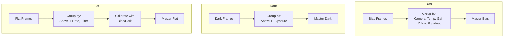
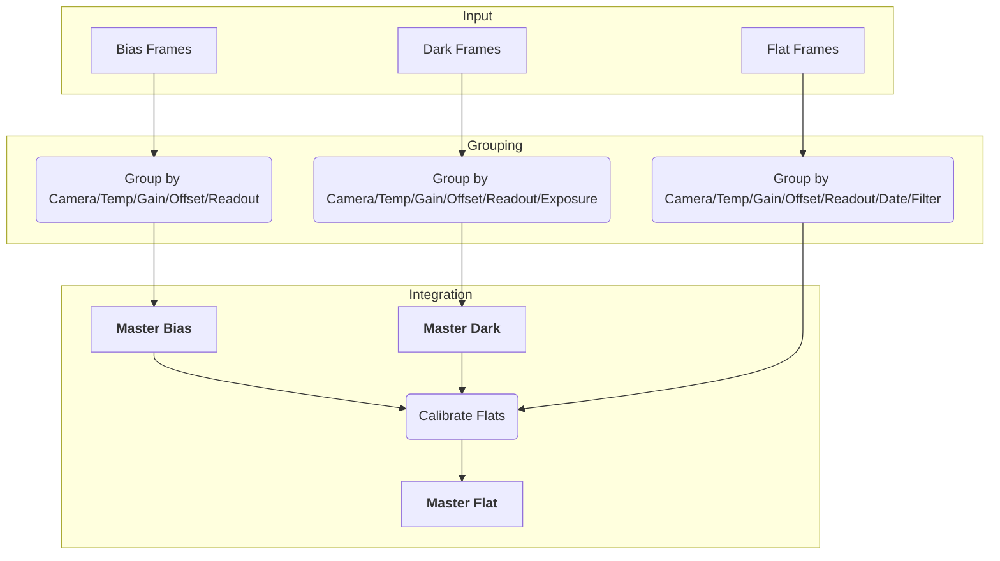

# ap-create-master

Automated generation of master calibration frames using PixInsight.

## Overview

`ap-create-master` discovers calibration frames, groups them by metadata, and generates master bias, dark, and flat frames using PixInsight.

## Installation

```bash
python -m pip install git+https://github.com/jewzaam/ap-create-master.git
```

## Requirements

- Python 3.10+
- PixInsight installed
- Calibration frames with proper FITS keywords

## Usage

```bash
python -m ap_create_master <input_dir> <output_dir> [options]
```

### Options

| Option | Description |
|--------|-------------|
| `input_dir` | Directory containing calibration frames |
| `output_dir` | Output directory for masters |
| `--bias-master-dir DIR` | Bias library for flat calibration |
| `--dark-master-dir DIR` | Dark library for flat calibration |
| `--pixinsight-binary PATH` | Path to PixInsight executable |
| `--script-only` | Generate scripts without executing |
| `--script-dir DIR` | Directory for scripts and logs (default: output_dir/logs) |
| `--instance-id ID` | PixInsight instance ID (default: 123) |
| `--no-force-exit` | Keep PixInsight open after execution |
| `--dryrun` | Show what would be done without executing |
| `--debug` | Enable debug logging |
| `--quiet`, `-q` | Suppress progress output |

## Frame Grouping

Frames are automatically grouped by FITS keywords:





### Required FITS Keywords

| Keyword | Frame Types | Description |
|---------|-------------|-------------|
| `IMAGETYP` | All | Frame type (bias, dark, flat) |
| `INSTRUME` | All | Camera model |
| `SET-TEMP` | All | Sensor temperature |
| `GAIN` | All | Gain setting |
| `OFFSET` | All | Offset setting |
| `READOUTM` | All | Readout mode |
| `EXPOSURE` | Dark, Flat | Exposure time |
| `DATE-OBS` | Flat | Observation date |
| `FILTER` | Flat | Filter name |

NOTE: Missing keywords are ignored, but try to only have something like `READOUTM` missing..

## Output Structure

```
output_dir/
├── master/
│   ├── masterBias_INSTRUME_ASI294MC_SETTEMP_-10_GAIN_100_OFFSET_10.xisf
│   ├── masterDark_..._EXPOSURE_300.xisf
│   └── masterFlat_..._DATE-OBS_2026-01-29_FILTER_L.xisf
└── logs/
    ├── 20260129_123456_calibrate_masters.js
    └── 20260129_123456.log
```

## Staged Workflow

Masters created in a run are **not used** for flat calibration in that same run. For flats, use existing libraries or run in stages:

```bash
# Stage 1: Generate bias and dark masters
python -m ap_create_master ./bias_and_darks ./masters \
    --pixinsight-binary "/path/to/PixInsight"

# Stage 2: Generate flat masters using Stage 1 outputs
python -m ap_create_master ./flats ./output \
    --bias-master-dir ./masters/master \
    --dark-master-dir ./masters/master \
    --pixinsight-binary "/path/to/PixInsight"
```

## Master Matching

When matching library masters to flats:

- Match by: Camera, Temperature, Gain, Offset, Readout Mode
- Ignore: Date, Filter (these vary per flat group)
- Dark exposure: Prefer lower/equal, use higher if necessary

## Examples

### Basic Usage

```bash
python -m ap_create_master /calibration /output \
    --pixinsight-binary "C:\Program Files\PixInsight\bin\PixInsight.exe"
```

### With Existing Library

```bash
python -m ap_create_master /flats /output \
    --bias-master-dir /library/BIAS \
    --dark-master-dir /library/DARK \
    --pixinsight-binary "/opt/PixInsight/bin/PixInsight"
```

### Script Only (No Execution)

```bash
python -m ap_create_master /calibration /output --script-only
```

### Dry Run

```bash
# See what would be generated without executing
python -m ap_create_master /calibration /output --dryrun
```

### With Debug Output

```bash
python -m ap_create_master /calibration /output --debug \
    --pixinsight-binary "C:\Program Files\PixInsight\bin\PixInsight.exe"
```

### Quiet Mode

```bash
# Minimal output
python -m ap_create_master /calibration /output --quiet \
    --pixinsight-binary "C:\Program Files\PixInsight\bin\PixInsight.exe"
```

## Troubleshooting

**No frames found:**
- Check `IMAGETYP` is set correctly (bias, dark, flat)
- Verify file extensions (.fit, .fits)

**No matching master for flat:**
- Masters must match: INSTRUME, SETTEMP, GAIN, OFFSET, READOUTM
- Date and filter differences are expected

**PixInsight fails:**
- Check generated script in `logs/`
- Review execution log

## Repository

[github.com/jewzaam/ap-create-master](https://github.com/jewzaam/ap-create-master)
