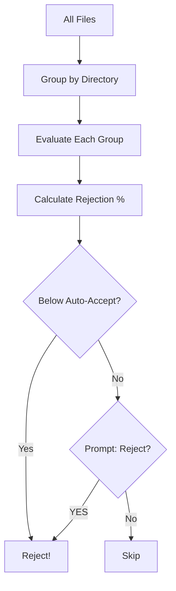

# ap-cull-light

Quality control filtering for light frames based on HFR and RMS thresholds.

## Overview

`ap-cull-light` evaluates light frames against quality thresholds and moves rejected frames to a separate directory while preserving structure.

## Installation

```bash
pip install git+https://github.com/jewzaam/ap-cull-light.git
```

## Usage

```bash
python -m ap_cull_lights <source_dir> <reject_dir> [options]
```

### Options

| Option | Description |
|--------|-------------|
| `source_dir` | Directory containing light frames |
| `reject_dir` | Directory for rejected frames |
| `--max-hfr FLOAT` | Maximum HFR threshold |
| `--max-rms FLOAT` | Maximum RMS threshold (arcsec) |
| `--auto-accept-percent FLOAT` | Auto-accept if rejection % below this |
| `--skip-regex REGEX` | Skip files matching pattern |
| `--debug` | Enable debug output |
| `--dryrun` | Preview without moving files |

## Quality Metrics

### HFR (Half Flux Radius)

Measures star focus quality. Higher values indicate worse focus or atmospheric conditions.

### RMS (Guiding Error)

Measures tracking accuracy in arcseconds. Higher values indicate guiding issues.

## Batch Processing

Files are grouped by directory for batch evaluation:



## Examples

### Basic Culling

```bash
python -m ap_cull_lights /data/10_Blink /reject --max-hfr 2.5 --max-rms 2.0
```

### With Auto-Accept

```bash
# Auto-accept if less than 5% rejected
python -m ap_cull_lights /data/10_Blink /reject \
    --max-hfr 2.5 --max-rms 2.0 --auto-accept-percent 5.0
```

### Skip Processed Files

```bash
# Skip files in "accept" or "processed" directories
python -m ap_cull_lights /data /reject \
    --max-hfr 2.5 --max-rms 2.0 --skip-regex "accept|processed"
```

### Dry Run

```bash
python -m ap_cull_lights /data /reject --max-hfr 2.5 --max-rms 2.0 --dryrun
```

## Output

Rejected frames are moved to the reject directory with preserved relative paths:

```
# Original
/data/10_Blink/M42/DATE_2026-01-29/FILTER_L_EXP_300/image_047.fits

# After rejection
/reject/10_Blink/M42/DATE_2026-01-29/FILTER_L_EXP_300/image_047.fits
```

## Repository

[github.com/jewzaam/ap-cull-light](https://github.com/jewzaam/ap-cull-light)
