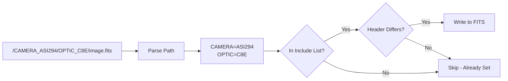

# ap-fits-headers

Preserve metadata from file paths into FITS/XISF headers.

## Overview

`ap-fits-headers` extracts key-value pairs encoded in directory paths and filenames and writes them as FITS header keywords. This is useful when metadata cannot be captured in headers at acquisition time.

## Installation

```bash
pip install git+https://github.com/jewzaam/ap-fits-headers.git
```

## Usage

```bash
python -m ap_fits_headers <root_dir> --include KEY [KEY ...] [options]
```

### Options

| Option | Description |
|--------|-------------|
| `root_dir` | Directory to scan recursively |
| `--include KEY ...` | Keys to extract and write (required) |
| `--debug` | Enable debug output |
| `--dryrun` | Preview without modifying files |

## How It Works



### Path Parsing

Key-value pairs are extracted from directory and file names using the pattern:
```
{KEY}_{VALUE}
```

Examples:
- `CAMERA_ASI294MC` → `CAMERA=ASI294MC`
- `OPTIC_C8E` → `OPTIC=C8E`
- `FILTER_Ha` → `FILTER=Ha`

### Idempotent Operation

The tool only updates headers when the value differs from the path value, making it safe to run multiple times.

## Examples

### Basic Usage

```bash
# Extract CAMERA and OPTIC from paths
python -m ap_fits_headers /data --include CAMERA OPTIC
```

### Multiple Keys

```bash
# Extract multiple metadata keys
python -m ap_fits_headers /data --include CAMERA OPTIC FILTER TARGET
```

### Preview Changes

```bash
python -m ap_fits_headers /data --include CAMERA OPTIC --dryrun
```

## Use Cases

### Metadata Not in Headers

Some capture setups cannot write all metadata to FITS headers. Encoding in paths allows preservation:

```
/data/CAMERA_ASI294MC/OPTIC_C8E/TARGET_M42/image.fits
```

### Before Master Calibration

Path metadata must be written to headers before creating master calibration frames, as PixInsight does not preserve path information:

```bash
# 1. Write path metadata to headers
python -m ap_fits_headers /calibration --include CAMERA OPTIC FILTER

# 2. Generate masters (metadata now in headers)
python -m ap_master_calibration /calibration /output ...
```

### Retroactive Processing

Can be run on existing datasets to add missing metadata:

```bash
# Fix old datasets missing header metadata
python -m ap_fits_headers /archive/2025 --include CAMERA OPTIC
```

## Repository

[github.com/jewzaam/ap-fits-headers](https://github.com/jewzaam/ap-fits-headers)
