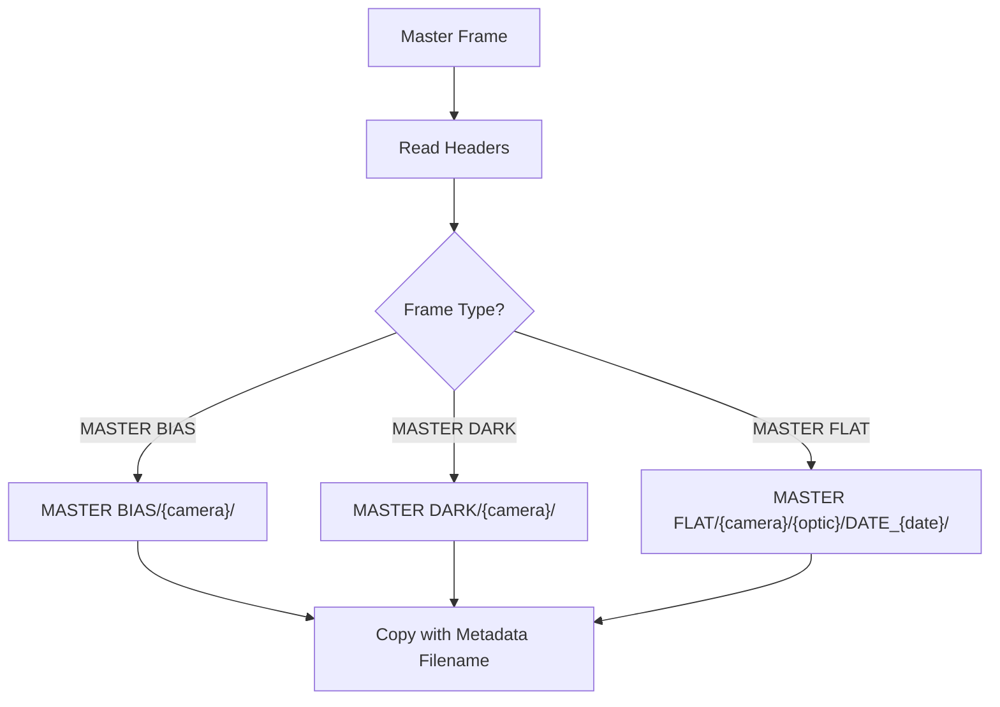

# ap-move-master-to-library

Organize master calibration frames into a structured library.

## Overview

`ap-move-master-to-library` copies master calibration frames from a source directory (e.g., PixInsight output) to an organized library structure based on FITS/XISF header metadata.

## Installation

```bash
python -m pip install git+https://github.com/jewzaam/ap-move-master-to-library.git
```

## Usage

```bash
python -m ap_move_master_to_library <source_dir> <dest_dir> [options]
```

### Options

| Option | Description |
|--------|-------------|
| `source_dir` | Directory containing master frames |
| `dest_dir` | Destination library directory |
| `--quiet`, `-q` | Suppress non-essential output (progress, INFO logs, summaries) |
| `--debug` | Enable debug output |
| `--dryrun` | Preview without copying |
| `--no-overwrite` | Fail if destination exists |

## Output Structure

```
{dest_dir}/
├── MASTER BIAS/
│   └── {camera}/
│       └── masterBias_GAIN_{gain}_OFFSET_{offset}_SETTEMP_{settemp}_READOUTM_{readoutmode}.xisf
│
├── MASTER DARK/
│   └── {camera}/
│       └── masterDark_EXPOSURE_{exposure}_GAIN_{gain}_OFFSET_{offset}_SETTEMP_{settemp}_READOUTM_{readoutmode}.xisf
│
└── MASTER FLAT/
    └── {camera}/
        └── {optic}/           # Only if optic in header
            └── DATE_{YYYY-MM-DD}/
                └── masterFlat_FILTER_{filter}_GAIN_{gain}_OFFSET_{offset}_SETTEMP_{settemp}_FOCALLEN_{focallength}_READOUTM_{readoutmode}.xisf
```

## Organization Logic



### Frame Type Detection

Identifies master frame type from `IMAGETYP` header:
- `MASTER BIAS` → MASTER BIAS directory
- `MASTER DARK` → MASTER DARK directory
- `MASTER FLAT` → MASTER FLAT directory

### Metadata Extraction

| Frame Type | Directory Keys | Filename Keys |
|------------|----------------|---------------|
| MASTER BIAS | Camera | Gain, Offset, Temp, Readout |
| MASTER DARK | Camera | Exposure, Gain, Offset, Temp, Readout |
| MASTER FLAT | Camera, Optic, Date | Filter, Gain, Offset, Temp, Focal Length, Readout |

## Examples

### Basic Usage

```bash
python -m ap_move_master_to_library /pixinsight/output/master /calibration/library
```

### Preview Changes

```bash
python -m ap_move_master_to_library /output /library --dryrun
```

### Fail on Existing Files

```bash
python -m ap_move_master_to_library /output /library --no-overwrite
```

### Debug Output

```bash
python -m ap_move_master_to_library /output /library --debug
```

## Workflow Integration

This tool is typically used after master generation:

```bash
# 1. Generate masters with PixInsight
python -m ap_create_master /raw_calibration /output \
    --pixinsight-binary "/path/to/PixInsight"

# 2. Organize into library
python -m ap_move_master_to_library /output/master /calibration/library
```

## Library Benefits

The organized structure allows:
- Quick lookup by camera and optical configuration
- Deduplication of identical frames


## Default Behavior

- **Overwrites** existing files (use `--no-overwrite` to prevent)
- Reports files copied and any errors
- Preserves original files (copy, not move)

## Repository

[github.com/jewzaam/ap-move-master-to-library](https://github.com/jewzaam/ap-move-master-to-library)
