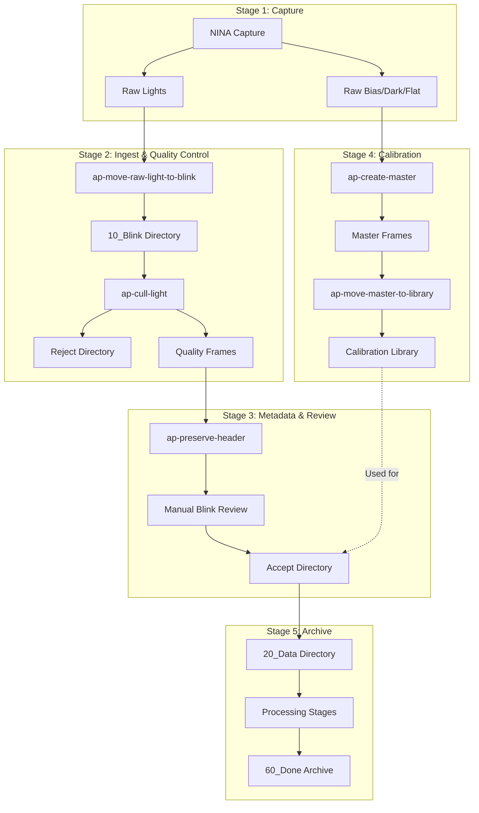
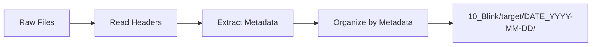
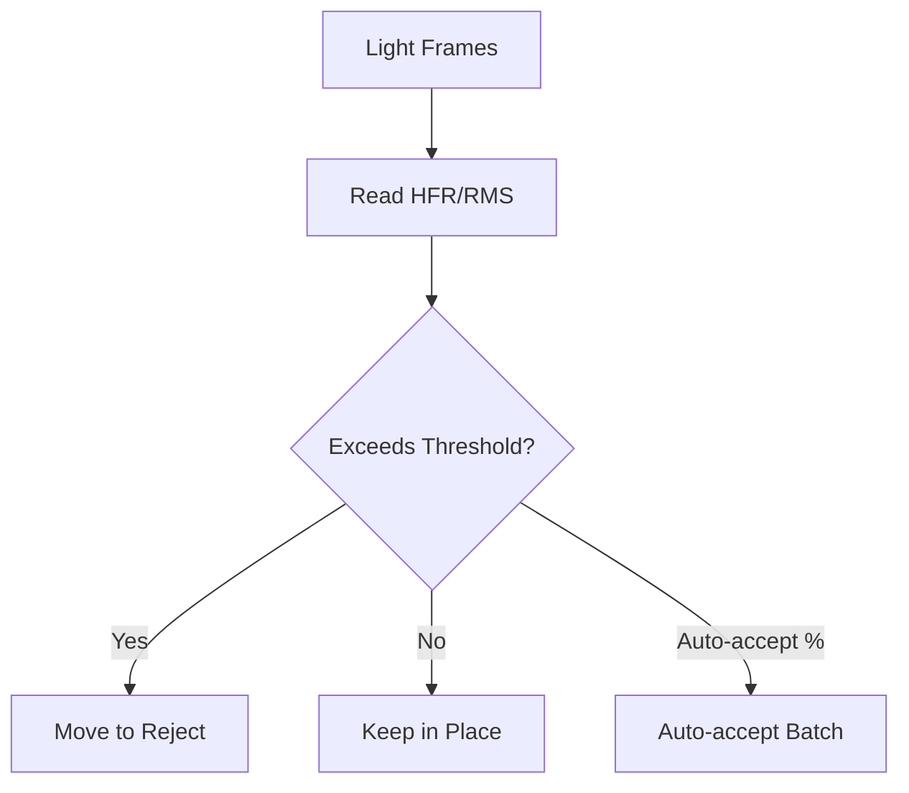
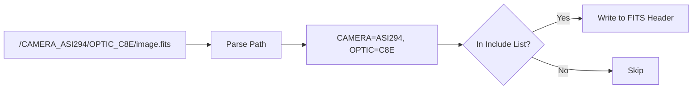
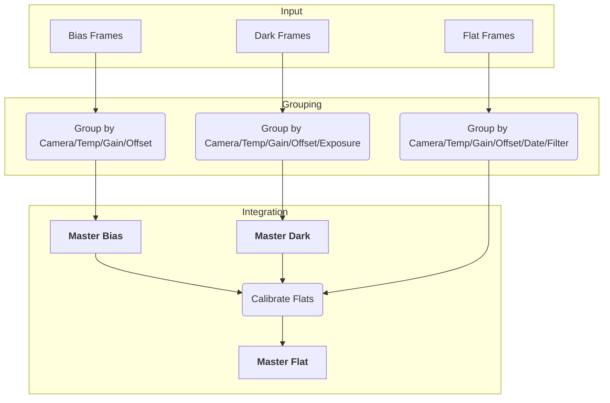

# Astrophotography Workflow Guide

This document describes the complete workflow for processing astrophotography data using the ap-* tools.

## Workflow Overview



## Stage Details

### Stage 1: Image Capture

Images are captured using NINA (Nighttime Imaging 'N' Astronomy) and saved to a raw directory. NINA writes FITS headers with metadata about the capture settings.

**Output**: Raw FITS/XISF files in capture directory

### Stage 2: Ingest and Quality Control

#### 2a. Move Light Frames

```bash
python -m ap_move_lights <raw_dir> <dest_dir> [options]
```

The `ap-move-raw-light-to-blink` tool:
1. Scans raw directory for FITS/XISF files
2. Reads headers to extract metadata (camera, optic, target, date, filter)
3. Moves LIGHT frames to organized directory structure
4. Creates `accept` subdirectories for reviewed frames



**Directory Structure Created**:
```
{dest_dir}/
└── {optic}@f{focal_ratio}+{camera}/
    └── 10_Blink/
        └── {target}/
            └── DATE_{YYYY-MM-DD}/
                └── FILTER_{filter}_EXP_{exposure}/
                    ├── image_001.fits
                    └── accept/   # For manually reviewed frames
```

#### 2b. Cull Poor Quality Frames

```bash
python -m ap_cull_lights <source_dir> <reject_dir> --max-hfr 2.5 --max-rms 2.0 [options]
```

The `ap-cull-light` tool:
1. Scans for LIGHT frames
2. Reads HFR (Half Flux Radius) and RMS (guiding error) from headers
3. Groups files by directory for batch processing
4. Moves rejected frames to reject directory



**Threshold Logic**:
- Reject if HFR > max_hfr
- Reject if RMS > max_rms
- Auto-accept batch if rejection % below threshold

### Stage 3: Metadata Preservation and Manual Review

#### 3a. Preserve Path Metadata in Headers

```bash
python -m ap_fits_headers <root_dir> --include CAMERA OPTIC FILTER [options]
```

Some metadata is encoded in directory paths rather than FITS headers. This tool:
1. Scans for key-value pairs in directory names (e.g., `CAMERA_ASI294MC`)
2. Inserts specified keys into FITS headers
3. Only updates if value differs (idempotent)



#### 3b. Manual Blink Review

Using PixInsight's Blink tool, visually inspect frames to identify:

- Cloud interference
- Focusing issues
- Other artifacts

Move approved frames to the `accept/` subdirectory.

### Stage 4: Calibration Frame Management

#### 4a. Generate Master Calibration Frames

```bash
python -m ap_master_calibration <input_dir> <output_dir> --pixinsight-binary "/path/to/PixInsight" [options]
```

The `ap-create-master` tool:
1. Discovers and groups calibration frames by FITS keywords
2. Generates master bias, dark, and flat frames using PixInsight
3. Calibrates flats with bias/dark masters



**Grouping Keys**:

| Frame Type | Grouping Keys |
|------------|---------------|
| Bias | Camera, Temperature, Gain, Offset, Readout Mode |
| Dark | Above + Exposure Time |
| Flat | Above + Date, Filter |

#### 4b. Organize Calibration Library

```bash
python -m ap_move_calibration <source_dir> <library_dir> [options]
```

The `ap-move-master-to-library` tool organizes master frames into a library structure:

```
{library_dir}/
├── MASTER BIAS/
│   └── {camera}/
│       └── masterBias_GAIN_100_OFFSET_10_SETTEMP_-10_READOUTM_HighSpeed.xisf
├── MASTER DARK/
│   └── {camera}/
│       └── masterDark_EXPOSURE_300_GAIN_100_OFFSET_10_SETTEMP_-10_READOUTM_HighSpeed.xisf
└── MASTER FLAT/
    └── {camera}/
        └── {optic}/
            └── DATE_2026-01-29/
                └── masterFlat_FILTER_L_GAIN_100_OFFSET_10_SETTEMP_-10_FOCALLEN_2032_READOUTM_HighSpeed.xisf
```

### Stage 5: Processing and Archive

Light frames progress through workflow stages:


| Stage | Purpose |
|-------|---------|
| 10_Blink | Initial review (quality check) |
| 20_Data | Collecting more data, calibration needs |
| 30_Master | Creating master lights |
| 40_Process | Active processing in PixInsight |
| 50_Bake | Review before publishing |
| 60_Done | Published, ready for archive |

## Complete Workflow Script Example

```bash
#!/bin/bash
# Example nightly processing workflow

RAW_DIR="/capture/tonight"
DATA_DIR="/data/astrophotography"
REJECT_DIR="/data/reject"
CAL_INPUT="/calibration/raw"
CAL_OUTPUT="/calibration/output"
CAL_LIBRARY="/calibration/library"
PIXINSIGHT="/opt/PixInsight/bin/PixInsight"

# Step 1: Move light frames
python -m ap_move_lights "$RAW_DIR" "$DATA_DIR"

# Step 2: Cull poor quality frames
python -m ap_cull_lights "$DATA_DIR/*/10_Blink" "$REJECT_DIR" \
    --max-hfr 2.5 --max-rms 2.0 --auto-accept-percent 5.0

# Step 3: Preserve path metadata
python -m ap_fits_headers "$DATA_DIR" --include CAMERA OPTIC FILTER

# Step 4: Generate master calibration frames
python -m ap_master_calibration "$CAL_INPUT" "$CAL_OUTPUT" \
    --pixinsight-binary "$PIXINSIGHT"

# Step 5: Organize calibration library
python -m ap_move_calibration "$CAL_OUTPUT/master" "$CAL_LIBRARY"

echo "Processing complete!"
```

## Tips and Best Practices

1. **Always use `--dryrun` first** - Preview changes before executing
2. **Group files before culling** - Organize by target/session for proper batch processing
3. **Preserve headers early** - Run `ap-preserve-header` before generating masters
4. **Stage calibration generation** - Generate bias/darks first, then flats
5. **Use consistent naming** - Let the tools handle organization based on metadata
