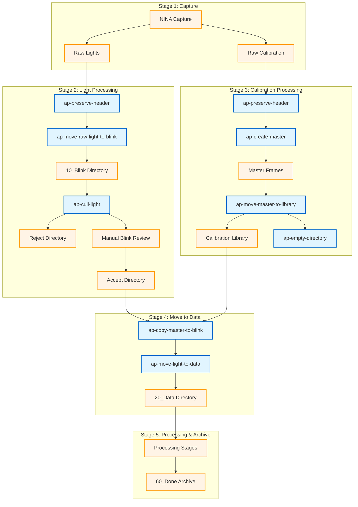
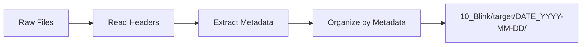
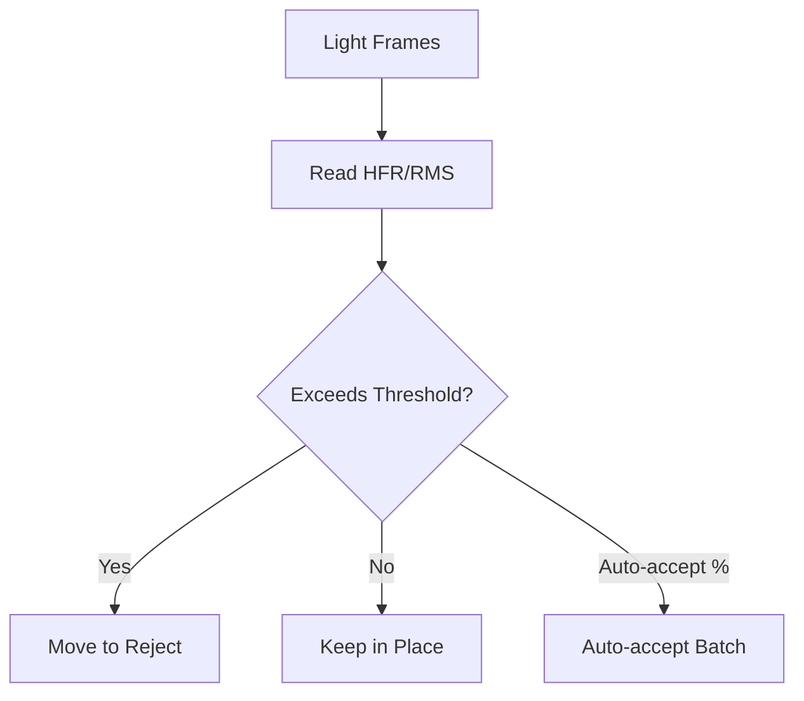
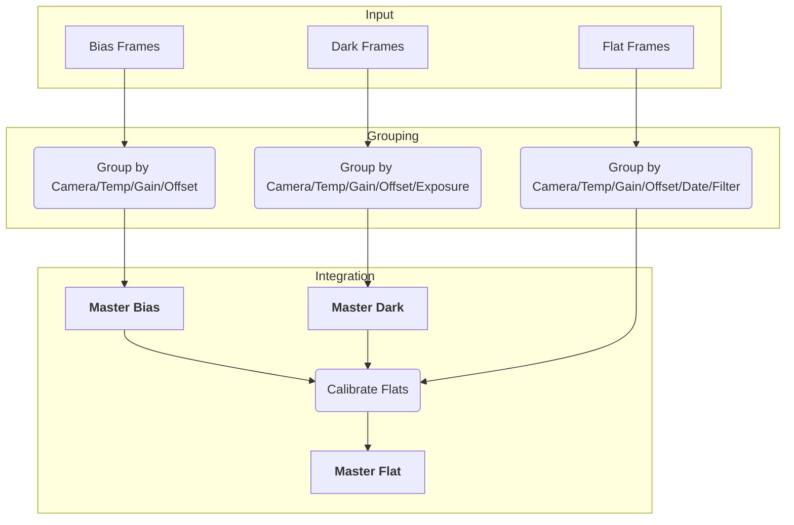
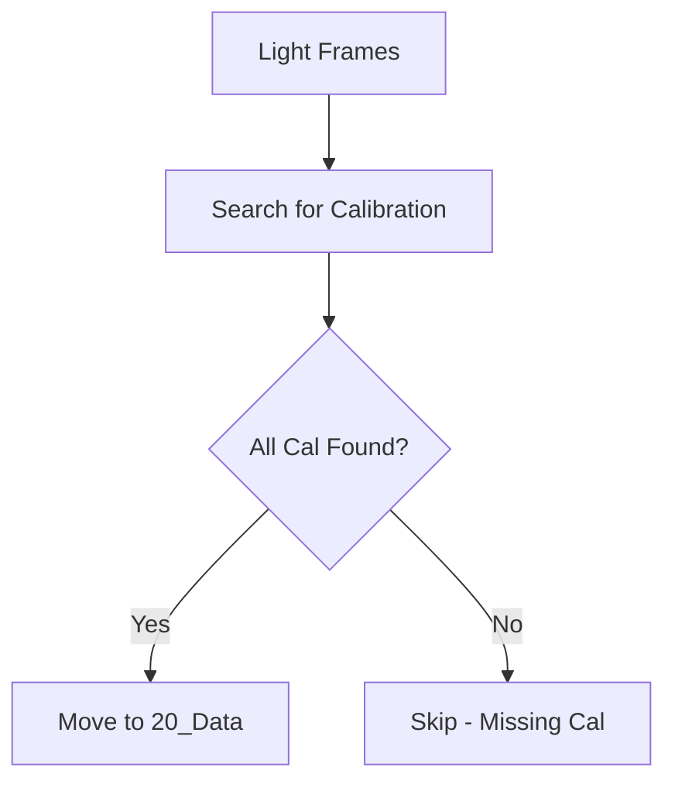

# Astrophotography Workflow Guide

This document describes the complete workflow for processing astrophotography data using the ap-* tools.

## Workflow Overview



## Stage Details

### Stage 1: Image Capture

Images are captured using NINA (Nighttime Imaging 'N' Astronomy) and saved to a raw directory. NINA writes FITS headers with metadata about the capture settings.

**Output**: Raw FITS/XISF files in capture directory

### Stage 2: Light Processing

#### 2a. Preserve Header Metadata

```bash
python -m ap_fits_headers <raw_dir> --include CAMERA OPTIC FILTER [options]
```

The `ap-preserve-header` tool:
1. Scans raw directory for FITS/XISF files
2. Extracts key-value pairs from directory paths and filenames
3. Writes specified keys to FITS headers
4. Ensures metadata is preserved before file movement

**Why First**: Path-based metadata must be written to headers before moving files, as the organized structure may not preserve all path information.

#### 2b. Move Light Frames

```bash
python -m ap_move_lights <raw_dir> <dest_dir> [options]
```

The `ap-move-raw-light-to-blink` tool:
1. Scans raw directory for FITS/XISF files
2. Reads headers to extract metadata (camera, optic, target, date, filter)
3. Moves LIGHT frames to organized directory structure
4. Creates `accept` subdirectories for reviewed frames



**Directory Structure Created**:
```
{dest_dir}/
└── {optic}@f{focal_ratio}+{camera}/
    └── 10_Blink/
        └── {target}/
            └── DATE_{YYYY-MM-DD}/
                └── FILTER_{filter}_EXP_{exposure}/
                    ├── image_001.fits
                    └── accept/   # For manually reviewed frames
```

#### 2c. Cull Poor Quality Frames

```bash
python -m ap_cull_lights <source_dir> <reject_dir> --max-hfr 2.5 --max-rms 2.0 [options]
```

The `ap-cull-light` tool:
1. Scans for LIGHT frames
2. Reads HFR (Half Flux Radius) and RMS (guiding error) from headers
3. Groups files by directory for batch processing
4. Moves rejected frames to reject directory



**Threshold Logic**:
- Reject if HFR > max_hfr
- Reject if RMS > max_rms
- Auto-accept batch if rejection % below threshold

### Stage 3: Calibration Processing

#### 3a. Preserve Header Metadata

```bash
python -m ap_fits_headers <raw_calibration_dir> --include CAMERA OPTIC FILTER [options]
```

Before creating master calibration frames, ensure all metadata is in FITS headers:
1. Scans raw calibration directory for FITS/XISF files
2. Extracts key-value pairs from directory paths and filenames
3. Writes specified keys to FITS headers

**Critical**: PixInsight does not preserve path-based metadata during master creation. All required metadata must be in FITS headers before running ap-create-master.

#### 3b. Generate Master Calibration Frames

```bash
python -m ap_master_calibration <input_dir> <output_dir> --pixinsight-binary "/path/to/PixInsight" [options]
```

The `ap-create-master` tool:
1. Discovers and groups calibration frames by FITS keywords
2. Generates master bias, dark, and flat frames using PixInsight
3. Calibrates flats with bias/dark masters



**Grouping Keys**:

| Frame Type | Grouping Keys |
|------------|---------------|
| Bias | Camera, Temperature, Gain, Offset, Readout Mode |
| Dark | Above + Exposure Time |
| Flat | Above + Date, Filter |

#### 3c. Organize Calibration Library

```bash
python -m ap_move_calibration <source_dir> <library_dir> [options]
```

The `ap-move-master-to-library` tool organizes master frames into a library structure:

```
{library_dir}/
├── MASTER BIAS/
│   └── {camera}/
│       └── masterBias_GAIN_100_OFFSET_10_SETTEMP_-10_READOUTM_HighSpeed.xisf
├── MASTER DARK/
│   └── {camera}/
│       └── masterDark_EXPOSURE_300_GAIN_100_OFFSET_10_SETTEMP_-10_READOUTM_HighSpeed.xisf
└── MASTER FLAT/
    └── {camera}/
        └── {optic}/
            └── DATE_2026-01-29/
                └── masterFlat_FILTER_L_GAIN_100_OFFSET_10_SETTEMP_-10_FOCALLEN_2032_READOUTM_HighSpeed.xisf
```

#### 3d. Copy Masters to Blink Directories

**⚠️ Tool not yet implemented - see placeholder documentation**

After organizing masters to the calibration library, copy the relevant master frames to the blink directories where light frames are located.

```bash
python -m ap_copy_masters_to_blink <library_dir> <blink_dir> [options]
```

The `ap-copy-master-to-blink` tool will:
1. Scan blink directories for light frames
2. Identify required master frames based on metadata
3. Search calibration library for matching masters (dark, flat, bias)
4. Copy matching masters to appropriate blink directories

**Matching Logic**:
- Darks: Match by camera, temp, gain, offset, readout mode, exposure
- Flats: Above + filter, date
- Bias: Camera, temp, gain, offset, readout mode

**Current State**: This step is currently performed manually. The tool is documented in the legacy workflow as `copycalibration.py` but needs refactoring into a standalone ap-* tool.

### Stage 4: Move Lights to Data

Once calibration frames are available in the blink directories, lights can be moved to the data directory for processing.

```bash
python -m ap_move_lights_to_data <source_dir> <dest_dir> [options]
```

The `ap-move-light-to-data` tool:
1. Scans for LIGHT frames in source directory
2. Searches for matching calibration frames (dark, flat, bias if needed)
3. Only moves lights when all required calibration is available
4. Preserves directory structure in destination



**Calibration Search Order**:
1. Look in lights directory first
2. Then search parent directories up to source boundary

**Required Calibration**:
- Dark (matching camera, temp, gain, offset, readout mode)
- Flat (above + filter)
- Bias (only if dark exposure ≠ light exposure)

### Stage 5: Processing and Archive

Light frames progress through workflow stages:


| Stage | Purpose |
|-------|---------|
| 10_Blink | Initial review (quality check) |
| 20_Data | Collecting more data, calibration needs |
| 30_Master | Creating master lights |
| 40_Process | Active processing in PixInsight |
| 50_Bake | Review before publishing |
| 60_Done | Published, ready for archive |

### Cleanup: Directory Maintenance

After processing, clean up working directories:

```bash
python -m ap_empty_directory <directory> [options]
```

The `ap-empty-directory` tool:
1. Removes files from specified directory
2. Optionally recurses into subdirectories with `--recursive`
3. Automatically removes empty directories after file deletion
4. Supports dry-run mode to preview changes

**Common Cleanup Tasks**:

```bash
# Clean calibration output directory after moving masters to library
python -m ap_empty_directory /calibration/output --recursive

# Clean raw calibration directory
# WARNING: Only do this AFTER both:
# 1. Integrating calibration frames (creating masters)
# 2. Moving masters to the calibration library
# If you skip either step, you'll need to restore or recreate the frames
python -m ap_empty_directory /calibration/raw --recursive

# Preview cleanup before executing
python -m ap_empty_directory /calibration/output --recursive --dryrun
```

## Complete Workflow Script Example

```bash
#!/bin/bash
# Example nightly processing workflow

RAW_DIR="/capture/tonight"
DATA_DIR="/data/astrophotography"
REJECT_DIR="/data/reject"
CAL_INPUT="/calibration/raw"
CAL_OUTPUT="/calibration/output"
CAL_LIBRARY="/calibration/library"
PIXINSIGHT="/opt/PixInsight/bin/PixInsight"

# Step 1: Move light frames
python -m ap_move_lights "$RAW_DIR" "$DATA_DIR"

# Step 2: Cull poor quality frames
python -m ap_cull_lights "$DATA_DIR/*/10_Blink" "$REJECT_DIR" \
    --max-hfr 2.5 --max-rms 2.0 --auto-accept-percent 5.0

# Step 3: Preserve path metadata
python -m ap_fits_headers "$DATA_DIR" --include CAMERA OPTIC FILTER

# Step 4: Generate master calibration frames
python -m ap_master_calibration "$CAL_INPUT" "$CAL_OUTPUT" \
    --pixinsight-binary "$PIXINSIGHT"

# Step 5: Organize calibration library
python -m ap_move_calibration "$CAL_OUTPUT/master" "$CAL_LIBRARY"

# Step 6: Clean calibration output directory
python -m ap_empty_directory "$CAL_OUTPUT" --recursive

# Step 7: Copy masters from library to blink directories
# NOTE: Tool not yet implemented - currently done manually
# python -m ap_copy_masters_to_blink "$CAL_LIBRARY" "$DATA_DIR/*/10_Blink"

# Step 8: Move lights to data when calibration available
python -m ap_move_lights_to_data \
    "$DATA_DIR/RedCat51@f4.9+ASI2600MM/10_Blink" \
    "$DATA_DIR/RedCat51@f4.9+ASI2600MM/20_Data"

# OPTIONAL: Clean raw calibration (only after integration AND library move!)
# python -m ap_empty_directory "$CAL_INPUT" --recursive

echo "Processing complete!"
```

## Tips and Best Practices

1. **Always use `--dryrun` first** - Preview changes before executing
2. **Group files before culling** - Organize by target/session for proper batch processing
3. **Preserve headers early** - Run `ap-preserve-header` before generating masters
4. **Stage calibration generation** - Generate bias/darks first, then flats
5. **Use consistent naming** - Let the tools handle organization based on metadata
